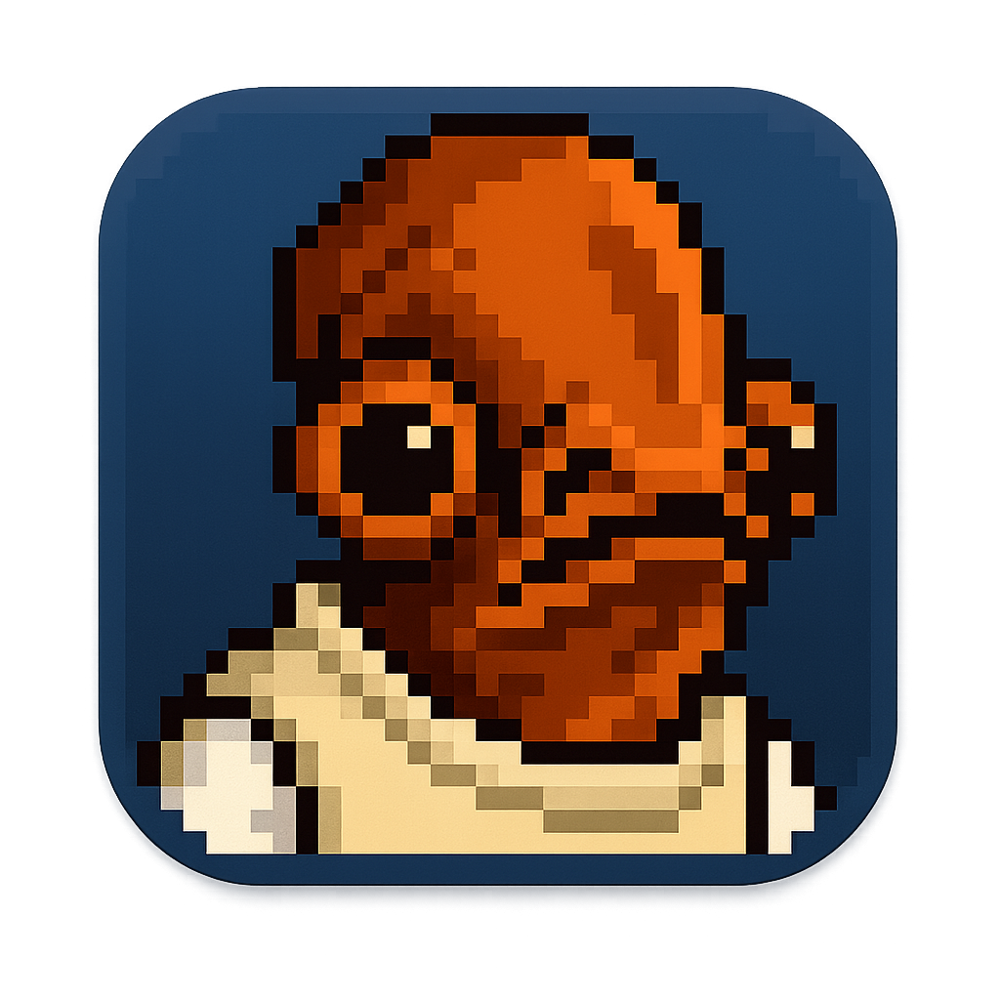

<div align="center">
  
  
  # ackbar
  
  **A lightweight macOS menu bar manager**
  
  Hide menu bar icons instantly • Keyboard shortcuts • Auto-hide • Position memory
  
  [](https://opensource.org/licenses/MIT)
  [](https://www.apple.com/macos/)
  [](https://swift.org/)
</div>

---

## ✨ Features

- 🚀 **Instant Toggle** - Hide/show icons with one click or keyboard shortcut
- 💾 **Position Memory** - Remembers your icon arrangement between launches
- ⏱️ **Auto-Hide** - Automatically hides icons after customizable delay
- ⌨️ **Keyboard Shortcuts** - ⌘⌃M to toggle, ⌘⌃⌥M for emergency reset
- 🎯 **Smart Design** - Chevron button stays visible and can't be accidentally hidden
- 🪶 **Lightweight** - Single Swift file, no dependencies
- 🖥️ **Multi-display** - Works across all connected displays

## Installation

### Quick Install (Recommended)

```bash
curl -sSL https://raw.githubusercontent.com/axeberg/ackbar/main/scripts/install.sh | bash
```

### Manual Install

1. Clone the repository:
   ```bash
   git clone https://github.com/axeberg/ackbar.git
   cd ackbar
   ```

2. Install using just:
   ```bash
   just install-all  # Installs binary and Raycast scripts
   # or
   just install      # Installs only the binary
   ```

   Or manually:
   ```bash
   chmod +x ackbar
   sudo cp ackbar /usr/local/bin/
   ```

## Usage

### Basic Usage

```bash
# Hide menu bar icons
ackbar

# Press Ctrl+C to restore and exit
```

### Background Usage

```bash
# Run in background
ackbar &

# Stop background process
pkill -f ackbar
```

### Keyboard Shortcuts

- **⌘⌃M** - Toggle hide/show menu bar icons
- **⌘⌃⌥M** - Emergency reset (shows all icons)

### Integration Examples

**OBS Studio Automation:**
```bash
# Start recording script
#!/bin/bash
ackbar &
CLEANER_PID=$!
obs --startrecording

# Stop recording script
obs --stoprecording
kill $CLEANER_PID
```

**Screenshot Alias:**
```bash
# Add to ~/.zshrc
alias clean-screenshot='ackbar & sleep 0.5 && screencapture -i ~/Desktop/screenshot.png; pkill -f ackbar'
```

## 🔧 How It Works

Ackbar uses macOS's native status bar APIs to create a separator and control button:
- The **separator** expands to push icons out of view when hiding
- The **chevron button** provides quick toggle and menu access
- Icon positions are preserved using macOS's built-in `autosaveName` feature
- No hacks or private APIs - just clever use of standard macOS functionality

## Requirements

- macOS 10.14 or later
- Swift runtime (included with macOS)

## Building from Source

```bash
# Clone repository
git clone https://github.com/axeberg/ackbar.git
cd ackbar

# Build
swiftc -O ackbar -o ackbar

# Install
just install
```

## Troubleshooting

**Q: The overlay doesn't appear**
A: Make sure no other screen recording or overlay tools are running.

**Q: Some icons are still visible**
A: The tool preserves system-critical areas. Third-party apps in the far-right corner may remain visible.

**Q: How do I adjust the overlay area?**
A: Edit the `appleMenuWidth` and `rightPadding` values in the source code.

## Contributing

Contributions are welcome! Please feel free to submit a Pull Request.

## License

MIT License - see [LICENSE](LICENSE) file for details.

## Acknowledgments

- Inspired by the need for clean screen recordings
- Built with Swift and AppKit
- No external dependencies

---

Made with ❤️ for the macOS community
